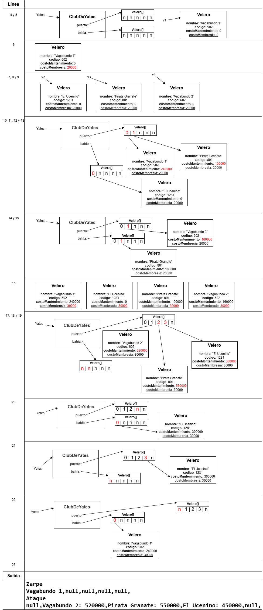

# Explicación detallada - Programación Orientada a Objetos

## Objetivo

Resolver el ruteo del Problema 1 y documentar la solución del Problema 2 (Mapaches Celulares).

## Ejercicio 1: Ruteo

### Modelo y reglas

- `Velero` modela una embarcación con nombre, codigo, costo acumulado y una tarifa estatica de membresia.
- `ClubDeYates` mantiene dos arreglos: `puerto` (ataque) y `bahia` (zarpe), ambos de tamaño 5.
- `atacar(v, dias)` agrega el velero al puerto (si no estaba) y acumula el costo: costo actual + (membresia * dias).
- `zarpar(v)` mueve el velero a bahia (si hay espacio) y lo elimina del puerto.
- `costoMembresia` es `static`, por lo que aplica a todos los veleros.

Nota: `costoMembresia` es un atributo estatico, no pertenece a ninguna instancia. Lo correcto es diagramar la clase `Velero` con este atributo. En el diagrama del ruteo se muestra en cada instancia solo para facilitar la comprension del ejercicio.

### Ruteo paso a paso

 para el línea a línea del ruteo y la salida.

**Resumen**

1) Se crean 4 veleros y se fija `costoMembresia = 20000`.
2) `v1` entra a puerto 12 dias (240000).
3) `v2` zarpa a bahia.
4) `v3` entra a puerto 5 dias (100000) y luego zarpa.
5) `v4` entra a puerto 8 dias (160000).
6) Se actualiza la membresia a 30000.
7) `v4` acumula 12 dias mas (520000 total).
8) `v3` entra a puerto 15 dias (550000 total).
9) `v2` entra a puerto 10 dias (300000), zarpa y vuelve a entrar 5 dias (450000 total).
10) `v1` zarpa a bahia.

### Estado final

- Bahia: `Vagabundo 1`, luego 4 posiciones `null`.
- Puerto: `Vagabundo 2`, `Pirata Granate`, `El Ucenino`, con sus costos, y un `null`.

### Salida esperada

```
Zarpe
Vagabundo 1,null,null,null,null,
Ataque
null,Vagabundo 2: 520000,Pirata Granate: 550000,El Ucenino: 450000,null,
```

## Ejercicio 2: Mapaches Celulares

### Modelo de clases

- `Mapache`: identidad (rut, nombre), masa y posicion en el tablero. Mantiene el estado individual de cada mapache y los datos necesarios para comparar fuerza en un combate.
- `Mapa`: tablero `Mapache[][]`, lista de mapaches y contador de vivos. Es el contenedor central del juego y concentra el estado global del tablero.
- `Main`: carga los archivos, construye las estructuras iniciales y ejecuta el menu principal del juego.

`Mapa` actua como contenedor central: encapsula la matriz del tablero, la coleccion de mapaches y el conteo de vivos, manteniendo la consistencia del estado. Desde ahi se coordinan las operaciones que modifican el juego (mover, alimentar, resolver combates, imprimir el tablero y consultar informacion), evitando que `Main` manipule estructuras internas directamente.

Como contenedor, `Mapa` cumple tres responsabilidades clave:
1) Almacena el estado del tablero en una matriz y asegura que cada celda tenga 0 o 1 mapache.
2) Mantiene la coleccion de mapaches para poder buscar por rut, iterar y contar vivos.
3) Aplica las reglas del juego cuando se solicita una accion, actualizando posiciones, masas y el contador de vivos de forma coherente.

### Carga de datos

1) `mapaches_posiciones.txt` define el orden del tablero y la matriz de ruts por celda. Este archivo indica en que posicion comienza cada mapache, y que celdas quedan vacias.
2) `mapaches.txt` define la cantidad de mapaches y los datos de cada uno (rut, nombre y masa). Se instancia cada `Mapache` con su identidad y masa inicial.
3) Primero se leen y se crean todos los `Mapache` desde `mapaches.txt`. Luego se lee `mapaches_posiciones.txt` y, por cada rut encontrado, se busca en el vector de mapaches y se coloca directamente en la matriz `Mapache[][]`; las celdas con 0 quedan en `null`.

### Reglas del juego

El flujo de juego se organiza por turnos y sigue estas reglas:
1) Al inicio de cada turno se imprime el tablero actual.
2) El jugador elige una accion del menu: mover, alimentar, ver informacion o rendirse.
3) La accion se valida y se ejecuta, actualizando el tablero y los estados.

Reglas especificas de las acciones:
- Mover: se solicita una direccion y se verifica que el destino este dentro del tablero. Si la celda destino esta vacia, el mapache se mueve. Si esta ocupada, se inicia un combate.
- Combate: se compara la masa de ambos mapaches. Gana el de mayor masa, el perdedor se elimina del tablero y el contador de vivos disminuye.
- Alimentar: aumenta la masa del mapache en 10% para reflejar el crecimiento.
- Ver informacion: muestra los datos del mapache en el formato solicitado (dos lineas).
- Rendirse: termina el juego inmediatamente.

Sistema de turnos: es un esquema simple de dos jugadores. Si el turno es par juega el jugador 0, si es impar juega el jugador 1. En cada turno se elige un mapache del jugador correspondiente y se ejecuta una accion.

Vector con indice `cantMapaches`: en las condiciones del ejercicio no se permite usar `ArrayList` ni `LinkedList`, por lo que se trabaja con un arreglo fijo `Mapache[]` y un indice `cantMapaches` que representa el tamano logico del vector (y coincide con la cantidad de vivos). Los mapaches validos quedan en las posiciones 0 a `cantMapaches - 1`, y cualquier recorrido se limita a ese rango.

Cuando se elimina un mapache, se aplica corrimiento: se desplazan a la izquierda los elementos desde la posicion eliminada hasta `cantMapaches - 2`, se deja libre la ultima celda y se decrementa `cantMapaches`. Esto evita huecos en el arreglo y mantiene consistente el orden para los turnos.

Ejemplo de corrimiento: si el arreglo valido es `[A, B, C, D]` con `cantMapaches = 4` y se elimina `B` (indice 1), se mueve `C` a la posicion 1 y `D` a la posicion 2. El arreglo queda `[A, C, D, D]`, luego se decrementa `cantMapaches` a 3 y el contenido valido pasa a ser `[A, C, D]`.

El juego termina cuando queda un solo mapache vivo o cuando alguien se rinde.

### Formato de salida

El programa sigue el formato de los ejemplos entregados. En particular:
1) Se muestra el tablero antes de cada turno, usando `_` para celdas vacias.
2) Se despliega el menu numerado de acciones y se lee la eleccion del jugador.
3) En caso de combate, se informa con el texto `Compiten A/NOMBRE con B/NOMBRE: gana NOMBRE`.
4) La informacion del mapache se imprime en dos lineas, separando identidad y atributos.

## Manejo de errores

Se considera el manejo de errores para mantener el flujo de juego estable:
1) Se captura `IllegalArgumentException` al convertir entradas invalidas (por ejemplo, cuando el usuario ingresa texto en lugar de un numero).
2) Se controla `NullPointerException` cuando se intenta operar con un rut que no existe en el mapa.
3) Si la direccion no es valida o el movimiento sale del tablero, se informa el error y no se realiza el movimiento.
4) Si la opcion del menu no esta dentro del rango permitido, se vuelve a solicitar una accion.

## Observaciones

- Los archivos de entrada deben estar en la ruta definida en `Main.java`.
- El formato de salida esta ajustado a los ejemplos entregados en la prueba.
