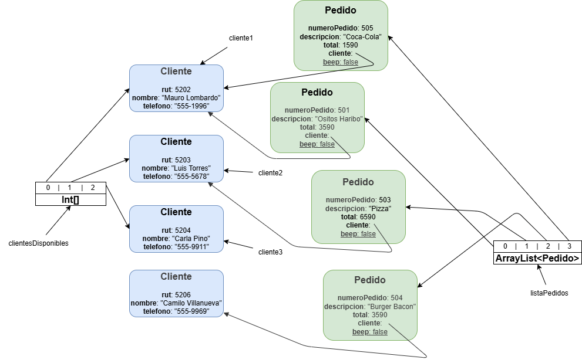
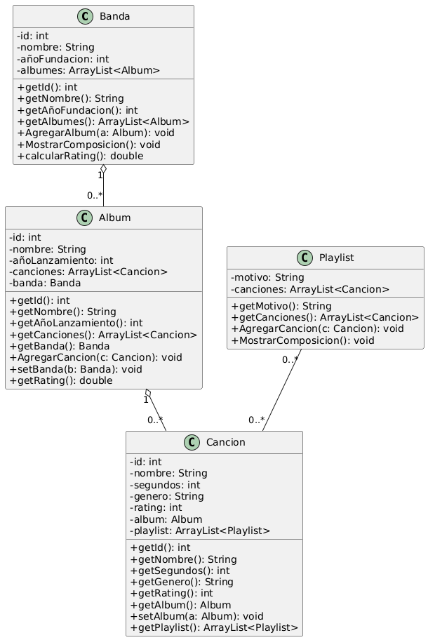

# Explicación detallada - Programación Orientada a Objetos

## Objetivo

Resolver el ruteo del Problema 1 y documentar la solución del Problema 2 (Music Analytics).

## Ejercicio 1: Ruteo

### Cómo se rutea

Se analiza el flujo de construcción de `Cliente` y `Pedido`, y el efecto del atributo estático `beep`.

### Por qué `beep` es estático

`beep` está declarado como `static`, por lo que **pertenece a la clase `Pedido` y no a cada instancia**:
- Todas las instancias comparten el mismo valor.
- Cada constructor de `Pedido` lee el mismo `beep`, imprime `VVS` si es `true`, y luego lo invierte.
- El efecto es alternado entre pedidos (uno imprime `VVS`, el siguiente no, etc.).

### Por qué `beep` se inicializa en `false`

En Java, un `static boolean` sin inicialización toma el valor por defecto del tipo primitivo: `false` (igual que un `int` toma `0`).
Por eso, el primer `Pedido` no imprime `VVS` y luego invierte a `true`.

### Qué pasaría si fuera una clase y no un primitivo

Si `beep` fuera `Pedido` (clase) y no se inicializara:
- Su valor por defecto sería `null`.
- La condición `if (beep)` lanzaría `NullPointerException`.

Si se inicializara explícitamente (`private static Boolean beep = false;`), el comportamiento sería equivalente al primitivo, pero con sobrecosto de envolver y desenvolver el valor.

### Consideración del ++numeroInicial

`++numeroInicial` es pre-incremento: primero aumenta el valor y luego lo usa. Por eso los números de pedido quedan 501, 502, 503, 504, 505 y 506 en ese orden.

### Consideración sobre garbage collector

Cuando un objeto queda **sin referencias**, el recolector de basura puede liberarlo. En el diagrama final no es necesario incluir instancias que ya no son alcanzables (por ejemplo, pedidos eliminados de la lista).

### Nota adicional sugerida

La lista `clientesDisponibles` mantiene referencias a los objetos Cliente apuntados por `cliente1`, `cliente2` y `cliente3`, por lo que esas instancias permanecen vivas aunque se eliminen pedidos asociados. Las variables locales siguen apuntando a los mismos objetos en memoria.

### Diferencia entre variable e instancia

Es importante distinguir:
- **Variable**: nombre que almacena una referencia (ejemplo: `cliente2`)
- **Instancia/Objeto**: el objeto real en memoria al que apunta la variable

Cuando modificamos `cliente2.setTelefono(...)`, no cambiamos la variable `cliente2`, sino el **objeto Cliente al que apunta** `cliente2`.

### Secuencia resumida

- Se crean 3 instancias de Cliente y se almacenan en las variables `cliente1`, `cliente2`, `cliente3`. Cada constructor imprime `Pedido.isBeep()`, que parte en `false`.
- Se crean instancias de Pedido y `beep` alterna en cada construcción.
- Se actualiza el teléfono del objeto Cliente referenciado por `cliente2` (asociado al pedido de Pizza).
- Se eliminan de la lista los pedidos con "Rollito de Canela" y "Handroll".
- Se imprime el objeto Cliente asociado al pedido de Burger Bacon (nueva instancia con RUT 5206).
- Se imprime la lista final de pedidos.

### Salida esperada (en orden)

```
false
false
false
VVS
true
VVS
Cliente [RUT=5206, Nombre=Camilo Villanueva, Teléfono=555-9969]

--- Lista de Pedidos Registrados ---
Pedido [Número=501, Descripción=Ositos Haribo, Total=$3590, Cliente=Mauro Lombardo]
Pedido [Número=503, Descripción=Pizza, Total=$6590, Cliente=Luis Torres]
Pedido [Número=504, Descripción=Burger Bacon, Total=$3590, Cliente=Camilo Villanueva]
Pedido [Número=505, Descripción=Coca-Cola, Total=$1590, Cliente=Mauro Lombardo]
```

### Diagrama de objetos



El diagrama muestra:
- Las instancias de Cliente y Pedido creadas
- Las referencias entre objetos
- El estado de las variables estáticas
- Los objetos que permanecen vivos vs los eliminados por el Garbage Collector

**Nota adicional:** En el diagrama, `beep` aparece dentro de cada instancia de Pedido para facilitar la comprensión del ruteo. Sin embargo, es importante recordar que `beep` es una variable `static`, por lo que **no pertenece a las instancias individuales sino a la clase `Pedido`**. En un diagrama UML formal, las variables estáticas se representarían separadamente en la sección de la clase, no en cada objeto.

### Estado final (resumen)

- El objeto Cliente referenciado por `cliente2` cambia su atributo teléfono a `555-2896`.
- Se elimina de la lista el pedido con descripción `Rollito de Canela` (num=502).
- Se elimina de la lista el pedido con descripción `Handroll` (num=506).
- La lista final queda con 4 pedidos: 501, 503, 504, 505.

## Ejercicio 2: Music Analytics

### Modelo de clases

- Banda: tiene id, nombre, año de fundación y una lista de `Album`.
- Album: tiene id, nombre, año de lanzamiento, lista de `Cancion` y referencia a su `Banda`.
- Cancion: tiene id, nombre, duración en segundos, género, rating, referencia a su `Album` y una lista de `Playlist`.
- Playlist: tiene motivo y una lista de `Cancion`.

### Relaciones 1..N

- Banda 1..N Album: Banda mantiene `ArrayList<Album> albumes`. Al crear un Album se agrega con `AgregarAlbum(a)` y el Album guarda la referencia a la Banda con `a.setBanda(this)`.
- Album 1..N Cancion: Album mantiene `ArrayList<Cancion> canciones`. Al crear una Cancion se agrega con `AgregarCancion(c)` y la Cancion guarda la referencia al Album con `c.setAlbum(this)`.
- Playlist 1..N Cancion: Playlist mantiene `ArrayList<Cancion> canciones`. Se agregan canciones con `AgregarCancion(c)` usando los IDs leídos del archivo.

### Relación N..N (conceptual)

Aunque la relación entre `Playlist` y `Cancion` es conceptualmente N..N (una playlist puede contener muchas canciones y una canción puede aparecer en muchas playlists), el ejercicio está planteado para enfocarse solo en las canciones dentro de cada playlist. En otras palabras, la jerarquía pone a las playlists por encima, por lo que se modela y navega desde `Playlist` hacia `Cancion`, sin necesidad de mantener la relación inversa en `Cancion`.

#### Nota Adicional
En el código se incluyeron estas relaciones 1..N y también la relación conceptual N..N (`Playlist`–`Cancion`). Aun cuando algunas referencias podrían ser innecesarias para resolver los reportes, se mantienen para dejar explícito el modelo y facilitar la navegación entre objetos.

### Paso a paso de la solución

#### 1) Carga de bandas

Método: CargarBandas
- Lee cada línea de bandas.txt
- Separa por comas
- Crea un objeto Banda y lo agrega a la lista

#### 2) Carga de música (álbumes y canciones)

Método: CargarMusica
- Lee la línea del álbum (id, nombre, idBanda, año, cantidad de canciones)
- Busca la Banda por id
- Crea el Album y lo agrega a la Banda
- Lee las N líneas de canciones
- Convierte la duración mm:ss a segundos (sólo por si acaso)
- Crea cada Cancion y la agrega al Album

#### 3) Carga de playlists

Método: CargarPlaylist
- Lee el encabezado de la playlist (motivo, cantidad de canciones)
- Lee la línea siguiente con los IDs de canciones
- Busca cada Cancion en las bandas/albumes y la agrega a la Playlist

### Manejo de excepciones

Se contempla `FileNotFoundException` al cargar archivos y `IllegalArgumentException` cuando una banda o canción no existe. La primera se captura en `main` y la segunda detiene la carga con un mensaje claro.

### Reportes (Lógica)

#### Reporte 1: Composición de estilos por banda

Método: Banda.MostrarComposicion
- Recorre las canciones de todos los álbumes
- Genera una lista de géneros únicos
- Cuenta cuántas canciones hay por género
- Calcula porcentaje sobre el total y lo imprime

#### Reporte 2: Composición de álbumes por playlist

Método: Playlist.MostrarComposicion
- Genera la lista de álbumes únicos presentes en la playlist
- Cuenta cuántas canciones pertenecen a cada álbum
- Calcula porcentaje sobre el total de canciones de la playlist

#### Reporte 3: Álbumes por década

Método: MostrarAlbumesPorDecada
- Junta todos los álbumes en una lista
- Ordena por año de lanzamiento
- Agrupa por década (año / 10 * 10)
- Imprime cada álbum con banda y año

#### Reporte 4: Rating promedio por banda

Método: Banda.calcularRating
- Calcula el promedio de rating de cada álbum (promedio de sus canciones)
- Promedia los ratings de los álbumes de la banda
- Imprime el resultado

### Diagrama de clases y agregación



La relación entre Banda y Album, y entre Album y Canción, se modela como agregación: los elementos pueden existir de forma independiente del contenedor. Por ejemplo, una banda puede existir sin álbumes (banda nueva o sin lanzamientos), y un álbum puede existir sin canciones cargadas aún (datos incompletos o en proceso). Del mismo modo, una playlist puede existir vacía o con canciones que se agregan después. Estas relaciones reflejan una pertenencia lógica, pero no una dependencia estricta de ciclo de vida.

## Observaciones

- El programa espera que los archivos de entrada estén en la carpeta de ejecución.
- Si un ID no existe, se lanza una excepción con mensaje descriptivo.
- En las consideraciones se indica que una canción tiene un solo estilo, por eso el género se modela como atributo de `Cancion`.