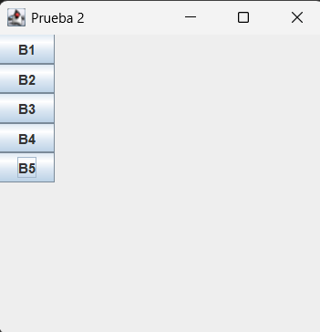
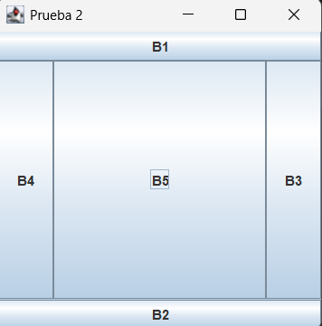

# Explicación Detallada - Prueba 2 POO 2024 S1

**Asignatura**: Programación Orientada a Objetos  
**Período**: 2024 Semestre 1  
**Fecha**: 22/06/2024  
**Profesores**: Alejandro Paolini, Moisés Moraga, Eric Ross

---

### Diferencia entre Factory y Visitor

Ambos son patrones de diseño, pero resuelven problemas distintos:

- **Factory** centraliza la creación de objetos. Se usa para encapsular la lógica de instanciación y evitar que el resto del sistema conozca las clases concretas.
- **Visitor** define operaciones sobre una jerarquía de clases sin modificar esas clases. Permite aplicar lógica distinta según el tipo concreto de instancia, sin usar `instanceof`.

En resumen:
- **Factory**: Crea objetos según una regla de negocio.
- **Visitor**: Aplica operaciones específicas según el tipo de objeto.

---

## Problema 1: Ruteo con Interfaz Gráfica

### Ejemplo de interfaz gráfica

Dependiendo de la configuración, la interfaz se verá así:

- **MiFactory1** (BorderLayout):



- **MiFactory2** (BoxLayout vertical):



### Respuestas a las preguntas del enunciado

Detalle completo en [Respuestas.md](src/RuteoGUI/Respuestas.md).

**¿Al presionar qué botón aparece un mensaje por la pantalla?**

El mensaje aparece al presionar el último botón creado, que es **B5**. En `Main.java`, el `ActionListener` se agrega después del `for`, por lo que queda asociado al último botón instanciado.

**¿Qué sucede al presionar el botón "X" de la ventana principal de su aplicación?**

No se cierra la aplicación. La ventana ignora el evento de cierre porque se configura con:

```java
frame.setDefaultCloseOperation(JFrame.DO_NOTHING_ON_CLOSE);
```

### Descripción del Problema

El ejercicio pide rutear una aplicación Swing que:
1. Solicita cuatro dígitos del RUT por consola.
2. Construye un número con esos dígitos.
3. Selecciona una fábrica de layout según si el número es par o impar.
4. Crea una ventana con 5 botones rotulados B1 a B5.

### Análisis del Código

#### Clase `Configurador`

Solicita cuatro dígitos del RUT y configura la fábrica:

```java
int t = a + 10*b + 100*c + 1000*d;
MiFactory.configurar(t);
```

Si `t` es par, se usa `MiFactory1`. Si es impar, se usa `MiFactory2`.

#### Clase `MiFactory` (Factory)

Define el contrato para crear el panel y agregar botones:

```java
public abstract JPanel crearPanel();
public abstract void agregarBoton(JPanel panel, JButton b);
```

#### Clase `MiFactory1`

Usa `BorderLayout` y agrega los botones en orden: NORTH, SOUTH, EAST, WEST, CENTER.

#### Clase `MiFactory2`

Usa `BoxLayout` con `PAGE_AXIS`, dejando los botones en una columna vertical.

#### Clase `Main`

Punto de entrada de la aplicación. Crea la ventana, instancia los botones y agrega el listener:

```java
b.addActionListener(e -> {
	System.out.println("Hola, soy el botón");
});
```

### Flujo de Ejecución

1. Se piden cuatro dígitos del RUT.
2. Se calcula `t` y se selecciona la fábrica según paridad.
3. Se crea el panel con el layout correspondiente.
4. Se agregan cinco botones (B1 a B5).
5. Se muestra la ventana y el botón B5 imprime el mensaje al presionarlo.

---

## Problema 2: New Jurassic World

### Descripción del Problema

Sistema que procesa dinosaurios a partir de `fauna.txt` y entrega tres reportes:

1. Cantidad por especie y hemisferio.
2. Dinosaurio más pesado, más alto y más veloz.
3. Dinosaurio con mayor tasa de adaptación.

### Modelado y Clases

#### Jerarquía de Dominio

- `Dinosaurio` (abstracta): id, peso, altura, velocidad, region
- Subclases: `Tiranosaurio`, `Triceratops`, `Velociraptor`, `Brachiosaurus`

Cada subclase agrega su atributo específico (cicatrices, planta favorita, distancia recorrida o largo de cuello).

#### Diagrama de clases

El diagrama de clases se encuentra en el archivo [diagrama_clases.puml](diagrama_clases.puml). Resume la jerarquia de `Dinosaurio`, el contrato `DinoVisitor`, y la separacion por paquetes (Dominio, Factory, Logica, Visitor).

### Patrones de Diseño Implementados

#### 1. **Factory** (DinoFactory)

Centraliza la creación de instancias según especie:

```java
Dinosaurio d = factory.getDinosaurio(especie, id, peso, altura, velocidad, region, atributo);
```

Permite aislar la lógica de instanciación y mantener el parseo en un solo lugar.

#### 2. **Visitor** (DinoVisitor)

Permite calcular reportes sin modificar las clases de dominio:

- `DinoVisitorCantidadPorEspecie`
- `DinoVisitorMasAtributo`
- `DinoVisitorMayorTasa`

Cada visitante implementa `visit()` para las cuatro especies y devuelve un resumen con `ShowInfo()`.

#### 3. **Singleton** (SistemaImpl y DinoFactory)

`SistemaImpl` y `DinoFactory` se instancian una sola vez con `getInstance()` para centralizar el estado.

### Arquitectura en Capas

```
src/
├── NewJurassicWorld/
│   ├── Dominio/
│   ├── Factory/
│   ├── Logica/
│   └── Visitor/
```

La clase `Sistema` define el contrato y `SistemaImpl` concentra la lista unica de dinosaurios.

### Flujo general de la solucion

1. `App` carga el archivo `fauna.txt` desde la carpeta de ejecucion.
2. Cada linea se parsea y se delega a `SistemaImpl` la creacion del objeto.
3. `DinoFactory` instancia la subclase correcta segun la especie.
4. Los reportes se calculan con Visitor recorriendo una unica lista de dinosaurios.

### Decisiones de diseño clave

- **Lista unica de dinosaurios:** respeta la restriccion del enunciado y simplifica el recorrido con Visitor.
- **Factory para instanciacion:** centraliza el parseo de especies y evita condicionales dispersas.
- **Visitor para reportes:** permite agregar nuevos calculos sin tocar las clases de dominio.
- **Singleton en `SistemaImpl` y `DinoFactory`:** asegura un unico punto de acceso al estado del sistema.

### Procesamiento del Archivo `fauna.txt`

Formato esperado:

```
id_dinosaurio,especie,peso,altura,velocidad,region,atributo
```

Ruta usada por el codigo:

```
fauna.txt
```

Cada linea se separa por coma y se crea el dinosaurio via `DinoFactory`.

### Manejo de excepciones y validaciones

- Si `fauna.txt` no existe, `App` captura `FileNotFoundException` y muestra un mensaje claro.
- En el calculo de tasa de adaptacion, se ignoran dinosaurios con altura o velocidad invalidas para evitar divisiones por cero.
- El resto del parseo asume formato correcto, consistente con los archivos de prueba entregados.

### Calculo de la Tasa de Adaptacion

La tasa depende de la especie:

$$
Tiranosaurio = \frac{peso}{altura^{cicatrices}}
$$

$$
Triceratops = \frac{peso \cdot velocidad}{2} \quad (Helechos)
$$

$$
Triceratops = \frac{peso \cdot velocidad}{3} \quad (Cicadaceas)
$$

$$
Velociraptor = \frac{distancia}{velocidad}
$$

$$
Brachiosaurus = (altura - largo\_cuello) \cdot peso
$$

En el visitor se valida altura y velocidad para evitar divisiones por cero; si son invalidas, se ignora el dinosaurio en el calculo de la tasa.

### Resultados Esperados

Al ejecutar `App.java`, el sistema imprime:

1. Cantidad por especie y hemisferio.
2. El dinosaurio mas pesado, mas alto y mas veloz.
3. El dinosaurio con mayor tasa de adaptacion.

El formato de salida esta alineado con [ejemplo.txt](../ejemplo.txt).

---

## Conclusión

Esta solución implementa:
- ✅ Ruteo GUI con Factory
- ✅ Jerarquia de clases y herencia
- ✅ Visitor para los reportes
- ✅ Arquitectura con `Sistema` y lista unica de dinosaurios

**Estado**: Implementación completa, documentación completa.