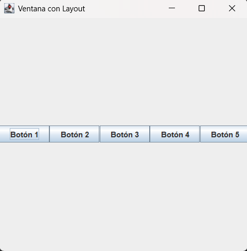
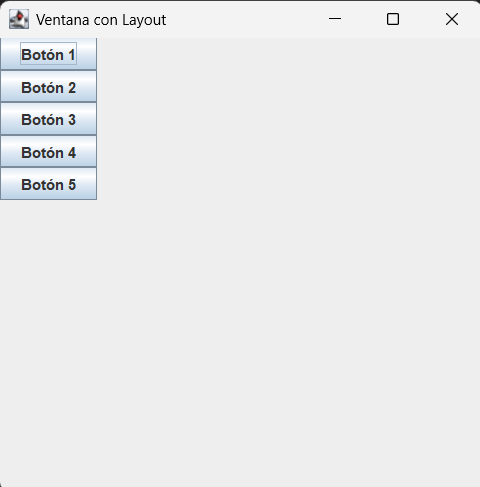

# Explicación Detallada - Prueba 2 POO 2024 S2

**Asignatura**: Programación Orientada a Objetos  
**Período**: 2024 Semestre 2  
**Fecha**: 28/11/2024  
**Profesores**: Alejandro Paolini, Moisés Moraga

---

### Diferencia entre Strategy y Visitor

Ambos son patrones de diseño, pero resuelven problemas distintos:

- **Strategy** permite cambiar el comportamiento de una instancia en tiempo de ejecución. Se usa para encapsular algoritmos o comportamientos intercambiables. En este proyecto, cada vehículo puede cambiar su modo de manejo (Eco, Normal, Sport) y, por lo tanto, su forma de calcular el consumo, sin cambiar su clase.

- **Visitor** permite definir operaciones sobre una jerarquía de clases sin modificar esas clases. Se usa para diferenciar y aplicar lógica específica según el tipo concreto de instancia. En este proyecto, Visitor permite recorrer la lista de vehículos y aplicar una lógica distinta si es Camioneta, SUV o Auto, sin usar `instanceof` ni modificar las clases de los vehículos.

En resumen:
- **Strategy**: Cambia el comportamiento de una instancia (cómo hace algo).
- **Visitor**: Permite diferenciar y operar según el tipo concreto de instancia (qué es la instancia).

## Problema 1: Ruteo con Interfaz Gráfica

### Ejemplo de interfaz gráfica

Dependiendo del cuarto dígito del RUT, la interfaz se verá así:

- Si el cuarto dígito es 0-5 (layout horizontal):



- Si el cuarto dígito es 6-9 (layout vertical):



### Respuestas a las preguntas del enunciado

Detalle completo en [Respuestas.md](src/RuteoGUI/Respuestas.md).

**¿Al presionar qué botón aparece un mensaje por la pantalla?**

Ningún botón muestra un mensaje por pantalla al ser presionado. En el código de `Main.java`, los botones se crean y agregan al panel, pero no tienen ningún `ActionListener` ni lógica asociada para mostrar mensajes. Por lo tanto, al presionar cualquier botón, no ocurre ninguna acción visible.

**¿Qué sucede al presionar el botón “X” de la ventana principal de su aplicación?**

Al presionar el botón “X” (cerrar ventana), la aplicación termina inmediatamente. Esto se debe a que en el código se configura:

```java
frame.setDefaultCloseOperation(JFrame.EXIT_ON_CLOSE);
```
Esto indica que al cerrar la ventana principal, el programa finaliza.

### Descripción del Problema

El ejercicio consiste en realizar el ruteo de código de una aplicación Swing que:
1. Solicita al usuario ingresar su RUT
2. Extrae el cuarto dígito del RUT (de derecha a izquierda, antes del dígito verificador)
3. Crea una ventana con 5 botones cuyo layout depende del cuarto dígito:
   - **Dígitos 0-5**: Layout horizontal (botones en fila)
   - **Dígitos 6-9**: Layout vertical (botones en columna)

### Análisis del Código

#### Clase `Main`
Punto de entrada de la aplicación. Utiliza el patrón Singleton para obtener una instancia única del `Configurator` y configura el layout según el RUT ingresado.

```java
public static void main(String[] args) {
    Configurator configurator = Configurator.getInstance();
    configurator.setStrategyBasedOnRut();
    configurator.applyLayout();
}
```

#### Clase `Configurator` (Patrón Singleton)

**Propósito**: Gestionar la configuración única del layout de la aplicación.

**Atributos:**
- `instance` (static): Instancia única del configurador
- `strategy`: Estrategia de layout seleccionada

**Métodos principales:**
- `getInstance()`: Implementación del patrón Singleton con lazy initialization
- `setStrategyBasedOnRut()`: Solicita el RUT y selecciona la estrategia
- `applyLayout()`: Aplica el layout seleccionado a la ventana
- `askForFourthRutDigit()`: Extrae el cuarto dígito del RUT

**Decisión de diseño**: Se utiliza Singleton porque solo debe existir una configuración de layout en la aplicación.

#### Interfaz `LayoutStrategy` (Patrón Strategy)

Define el contrato para las estrategias de layout:
```java
public interface LayoutStrategy {
    JPanel createLayout();
}
```

#### Clase `HorizontalLayoutStrategy`

Implementa layout horizontal usando `BoxLayout.X_AXIS`. Crea un panel con 5 botones dispuestos en fila.

#### Clase `VerticalLayoutStrategy`

Implementa layout vertical usando `BoxLayout.Y_AXIS`. Crea un panel con 5 botones dispuestos en columna.

### Patrones de Diseño Utilizados

#### 1. **Singleton** (Configurator)
- **Propósito**: Garantizar una única instancia del configurador
- **Implementación**: Constructor privado + método estático `getInstance()`
- **Beneficio**: Control centralizado de la configuración

#### 2. **Strategy** (LayoutStrategy)
- **Propósito**: Encapsular algoritmos de layout intercambiables
- **Participantes**:
  - **Contexto**: `Configurator`
  - **Estrategia**: `LayoutStrategy` (interface)
  - **Estrategias concretas**: `HorizontalLayoutStrategy`, `VerticalLayoutStrategy`
- **Beneficio**: Facilita agregar nuevos tipos de layout sin modificar el configurador

### Componentes Swing Utilizados

| Componente | Uso                                         |
|------------|---------------------------------------------|
| `JFrame`   | Ventana principal (400x400 px)              |
| `JPanel`   | Contenedor de botones                       |
| `JButton`  | 5 botones numerados ("Botón 1" a "Botón 5") |
| `BoxLayout`| Layout manager (X_AXIS o Y_AXIS)            |
| `Scanner`  | Lectura del RUT por consola                 |

### Flujo de Ejecución

1. Se obtiene la instancia única de `Configurator`
2. Se solicita el RUT al usuario
3. Se extrae el cuarto dígito: `rut.charAt(rut.length() - 5)`
4. Se selecciona la estrategia según el dígito:
   - 0-5 → `HorizontalLayoutStrategy`
   - 6-9 → `VerticalLayoutStrategy`
5. Se crea el `JFrame` y se aplica el layout
6. Se muestra la ventana con los botones

---

## Problema 2: Rent a Car

### Descripción del Problema

Sistema de gestión de flota de vehículos para una empresa de arriendo. Debe:

1. **Cargar información** desde `fleet.txt`:
   - Datos de vehículos (VIN, marca, modelo, tipo, eficiencia)
   - Registros de uso (VIN, modo de manejo, distancias)

2. **Calcular métricas**:
   - Kilometraje total por vehículo
   - Consumo de combustible según modo de manejo
   - Vehículo con mayor consumo por categoría

3. **Requisitos técnicos**:
   - Patrones: Visitor + Strategy + (Singleton O Factory)
   - Arquitectura de 3 capas
   - Herencia obligatoria
   - Sin ciclos anidados

### Patrones de Diseño Implementados

#### 1. **Factory** (IVehiculoFactory + VehiculoFactory)

**Propósito**: Centralizar la creación de vehículos según tipo.

**Interfaz y método de creación:**
```java
Vehiculo crearVehiculo(String tipo, String VIN, String marca, String modelo, double eficiencia)
```

La clase `VehiculoFactory` implementa la interfaz y mantiene el método estático
`getVehiculo(...)` para reutilización interna.

**Mapeo de tipos:**
- "P" → Camioneta (Pickup)
- "S" → SUV
- "C" → Auto (Car)

**Beneficio**: Encapsula la lógica de instanciación y facilita agregar nuevos tipos.

#### 2. **Strategy** (Modos de Manejo)

**Propósito**: Calcular el consumo según el modo de conducción.

**Interface `Strategy`:**
```java
double calcularConsumo(double eficiencia, int distancia)
```

**Estrategias concretas:**

| Modo   | Código | Ajuste en esta solución | Implementación          |
|--------|--------|-------------------------|-------------------------|
| Eco    | "E"    | Reduce consumo 10%      | `eficiencia * 1.111111` |
| Normal | "N"    | Sin cambio              | `eficiencia * 1.0`      |
| Sport  | "S"    | Aumenta consumo 25%     | `eficiencia * 0.8`      |

**Nota (detalle de la conversión):** El enunciado habla de eficiencia, pero el sistema calcula consumo con la formula
`consumo = distancia / eficiencia`. Por eso se ajusta la eficiencia y luego se aplica la misma formula.

- **Eco (eficiencia -10%)**: eficiencia_eco = 0.9 * eficiencia. Entonces
   `consumo = distancia / (0.9 * eficiencia)`, que es equivalente a dividir por 0.9, o multiplicar por 1.111111.
- **Sport (eficiencia +25%)**: eficiencia_sport = 1.25 * eficiencia. Entonces
   `consumo = distancia / (1.25 * eficiencia)`, que es equivalente a dividir por 1.25, o multiplicar por 0.8.

Así, los factores `1.111111` y `0.8` son equivalencias matematicas para reflejar el mismo cambio en consumo final.

**Implementación con Singleton:**
Cada modo de manejo es un Singleton (ej: `ModoEco.getModoEco()`) para evitar múltiples instancias idénticas.

**Beneficio**: Permite agregar nuevos modos sin modificar la clase `Vehiculo`.

#### 3. **Visitor** (VisitorMayorConsumo)

**Propósito**: Recorrer la colección de vehículos identificando el de mayor consumo por categoría.

**Interface `Visitor`:**
```java
void visit(SUV v);
void visit(Camioneta v);
void visit(Auto v);
String ShowInfo();
```

**Clase `VisitorMayorConsumo`:**

**Atributos:**
- `SConsumo`, `CConsumo`, `AConsumo`: Referencias a vehículos con mayor consumo
- `SuvConsumoMayor`, `CamionetaConsumoMayor`, `AutoConsumoMayor`: Valores máximos

**Funcionamiento:**
- Cada `visit()` compara el consumo actual con el máximo de su categoría
- `ShowInfo()` retorna un string formateado con los resultados

**Beneficio**: Separa el algoritmo de recorrido de la estructura de datos.

#### 4. **Singleton** (Modos de Manejo)

Cada estrategia de modo (ModoEco, ModoNormal, ModoSport) implementa Singleton para:
- Evitar crear múltiples instancias idénticas
- Ahorrar memoria cuando múltiples vehículos usan el mismo modo
- Implementar lazy initialization

### Arquitectura de 3 Capas

```
├── Dominio/          (Modelo)
│   ├── Vehiculo.java
│   ├── Camioneta.java
│   ├── SUV.java
│   └── Auto.java
│
├── Logica/           (Controlador)
│   ├── Sistema.java      (interface)
│   ├── SistemaImpl.java  (implementación)
│   └── App.java          (main)
│
├── Strategy/         (Patrón)
│   ├── Strategy.java
│   ├── ModoEco.java
│   ├── ModoNormal.java
│   └── ModoSport.java
│
├── Visitor/          (Patrón)
│   ├── Visitor.java
│   └── VisitorMayorConsumo.java
│
└── Factory/          (Patrón)
   ├── IVehiculoFactory.java
   └── VehiculoFactory.java
```

### Cálculo de Consumos

La fórmula base es:
```
Consumo (litros) = Distancia (km) / Eficiencia (km/litro)
```

**Aplicación de modos de manejo:**

1. **Modo Eco** (reduce consumo 10%):
   ```
   eficiencia_ajustada = eficiencia * 1.111 (1/0.9)
   ```

2. **Modo Normal** (consumo estándar):
   ```
   eficiencia_ajustada = eficiencia * 1.0
   ```

3. **Modo Sport** (aumenta consumo 25%):
   ```
   eficiencia_ajustada = eficiencia * 0.8 (1/1.25)
   ```

**Ejemplo:**
- Vehículo: eficiencia 15 km/litro
- Distancia: 100 km
- Modo Sport: eficiencia ajustada = 15 * 0.8 = 12 km/litro
- Consumo = 100 / 12 = 8.33 litros

### Procesamiento del Archivo `fleet.txt`

La solución espera el archivo en la ruta relativa `Txt/fleet.txt` desde el directorio de ejecución.

**Formato:**
```
<cantidad_vehículos>
VIN1,marca,modelo,tipo,eficiencia
VIN2,marca,modelo,tipo,eficiencia
...
VIN,modo,distancia1,distancia2,...
VIN,modo,distancia1,distancia2,...
```

**Lógica de carga en `App.java`:**

1. **Primera sección** (vehículos):
   ```java
   int valor = Integer.valueOf(lector.nextLine());
   for (int i = 0; i < valor; i++) {
       // Parsear línea y crear vehículo con Factory
       sistema.agregarVehiculo(tipo, VIN, marca, modelo, eficiencia);
   }
   ```

2. **Segunda sección** (usos):
   ```java
   while (lector.hasNextLine()) {
       // Para cada distancia en la línea
       for (int i = 2; i < p.length; i++) {
           sistema.registrarConsumo(VIN, modo, distancia);
       }
   }
   ```

### Funcionalidades Implementadas

#### 1. Calcular Kilometraje y Consumo
```java
sistema.CalcularKilometrajeYConsumo()
```
Itera sobre todos los vehículos mostrando:
- VIN
- Distancia total recorrida
- Combustible total consumido

#### 2. Mayores Consumidores por Categoría
```java
sistema.MayoresConsumidores()
```
Utiliza `VisitorMayorConsumo` para identificar:
- Camioneta con mayor consumo
- SUV con mayor consumo
- Auto con mayor consumo

### Decisiones de Diseño

#### ¿Por qué usar Singleton en las Estrategias?
Los modos de manejo no tienen estado mutable, por lo que compartir una única instancia:
- Ahorra memoria
- Simplifica la gestión de objetos
- Mantiene el código limpio

#### ¿Por qué usar Factory en lugar de Singleton para Vehículos?
Los vehículos tienen estado único (VIN, odómetro, consumo), por lo que:
- Cada instancia debe ser diferente
- Factory simplifica la creación según tipo
- Singleton no aplica para objetos con identidad única

#### ¿Por qué usar Visitor para búsqueda?
El patrón Visitor permite:
- Separar el algoritmo de búsqueda de la estructura
- Facilitar agregar nuevas operaciones (ej: calcular promedio por categoría)
- Mantener responsabilidades separadas

#### Consideración sobre ciclos
El enunciado indica evitar ciclos anidados. En la solución, la carga de usos
usa un `while` con un `for` interno para recorrer las distancias de cada línea.
El resto de recorridos se mantienen en un solo nivel.

### Resultados Esperados

Al ejecutar `App.java`, el sistema debe mostrar:

1. **Reporte de kilometraje y consumo:**
   ```
   VIN: ABC123
   Distancia total: 450 km
   Consumo total: 30.5 litros
   ```

2. **Mayores consumidores:**
   ```
   Camioneta: XYZ789 (85.3 litros)
   SUV: DEF456 (92.7 litros)
   Auto: GHI012 (45.2 litros)
   ```

#### Buenas prácticas: contratos y SOLID

Actualmente, la mejor práctica es documentar los contratos (Javadoc) en las interfaces y no en las implementaciones. Así, cualquier clase que implemente la interfaz conoce el comportamiento esperado, y la documentación se mantiene centralizada y coherente. Esto permite programar contra el contrato y no contra detalles internos.

**Ejemplo:**
```java
/**
 * Calcula el consumo de combustible para una distancia y eficiencia dadas.
 * @param eficiencia eficiencia del vehículo (km/l)
 * @param distancia distancia recorrida (km)
 * @return consumo en litros
 */
double calcularConsumo(double eficiencia, int distancia);
```

Además, el diseño de esta solución sigue los principios SOLID:

- **S (Single Responsibility):** Cada clase/interfaz tiene una única responsabilidad clara (ej: `SistemaImpl` gestiona la flota, `Strategy` define el cálculo de consumo, etc.).
- **O (Open/Closed):** El sistema es abierto a extensión (puedes agregar nuevos modos de manejo, tipos de vehículos, etc.) pero cerrado a modificación (no necesitas cambiar el código existente para nuevas funcionalidades).
- **L (Liskov Substitution):** Las subclases y las implementaciones de interfaces pueden ser usadas donde se espera la superclase/interfaz, sin alterar la lógica del programa.
- **I (Interface Segregation):** Las interfaces son específicas y no fuerzan a implementar métodos innecesarios. Por ejemplo, `Strategy` y `Visitor` definen contratos claros y acotados.
- **D (Dependency Inversion):** El código depende de abstracciones (interfaces) y no de implementaciones concretas. Por ejemplo, `SistemaImpl` recibe una `IVehiculoFactory`.

**Beneficios de este enfoque:**
- Facilita el mantenimiento y la extensión del sistema.
- Permite pruebas unitarias más simples (puedes usar mocks de interfaces).
- Reduce el acoplamiento y mejora la reutilización de código.
- Hace el sistema más robusto ante cambios y escalable para nuevas funcionalidades.

---

## Conclusión

Esta solución demuestra:
- ✅ Uso correcto de patrones de diseño (Visitor, Strategy, Factory, Singleton)
- ✅ Arquitectura en capas con separación de responsabilidades
- ✅ Herencia y polimorfismo en jerarquía de vehículos
- ✅ Programación orientada a objetos con bajo acoplamiento
- ✅ Código mantenible y extensible

**Estado**: Implementación completa, documentación completa.