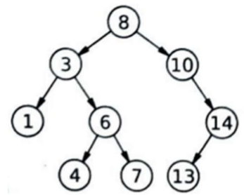

# Ejercicio 4

**Post-orden**

**Resultado:** 1 - 4 - 7 - 6 - 3 - 13 - 14 - 10 - 8



**Regla de recorrido (post-orden):**
1. Revisar izquierda.
2. Revisar derecha.
3. Mostrar el dato.

**Recorrido aplicado al árbol:**
```
Partimos en 8 (raiz)
    Revisamos izquierda -> 3
        Revisamos izquierda -> 1
            Revisamos izquierda: no hay nada
            Revisamos derecha: no hay nada
            *Imprimimos 1
        Revisamos derecha -> 6
            Revisamos izquierda -> 4
                Revisamos izquierda: no hay nada
                Revisamos derecha: no hay nada
                *Imprimimos 4
            Revisamos derecha -> 7
                Revisamos izquierda: no hay nada
                Revisamos derecha: no hay nada
                *Imprimimos 7
            *Imprimimos 6
        *Imprimimos 3
    Revisamos derecha -> 10
        Revisamos izquierda: no hay nada
        Revisamos derecha -> 14
            Revisamos izquierda -> 13
                Revisamos izquierda: no hay nada
                Revisamos derecha: no hay nada
                *Imprimimos 13
            Revisamos derecha: no hay nada
            *Imprimimos 14
        *Imprimimos 10
    *Imprimimos 8
```