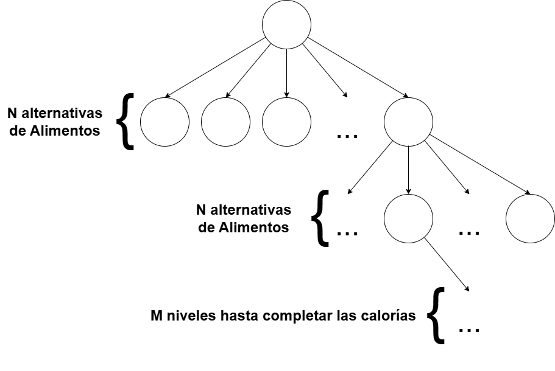

# Ejercicio 1 - Dieta (Backtracking)

## Modelamiento del problema

**a. Que representa la raiz del arbol?**
- Ningun alimento escogido.

**b. Cuales son los potenciales candidatos?**
- Todos los alimentos del archivo (N alimentos).

**c. Dibuje el arbol de busqueda (2 niveles ademas de la raiz)**



**d. Cuantos niveles tendra el arbol de busqueda?**
- No hay un numero fijo: depende de cuando se alcanza una solucion válida.

**e. Que representa cada nivel del arbol?**
- La cantidad de alimentos seleccionados hasta ese punto.

**f. En que nivel del arbol se podria encontrar la solucion?**
- En cualquier nivel que cumpla rango de calorias y cobertura de grupos.

**g. Que estructuras de datos necesita y para que?**
- `Grupo` con `cantAlimGrupo` para llevar el conteo por grupo.
- `Grupo[] grupos` de 7 posiciones (0..6) para los grupos alimenticios.
- `Alimento` con `nombre`, `calorias`, `grupo`.
- `Alimento[] alimentos` con todos los alimentos del archivo.
- `Alimento[] solucion` para registrar los alimentos elegidos.
- `int cantAlimentosDieta` para el tamanio actual de la solucion.

**h. Que significa ser aceptable?**
- La suma de calorias con el nuevo candidato no supera el limite superior.
- El grupo del candidato tiene menos de 2 alimentos seleccionados.

**i. Que significa registrar la seleccion?**
- Agregar el alimento a `solucion`.
- Incrementar `cantAlimentosDieta`.
- Incrementar el contador del grupo correspondiente.

**j. Que significa cancelar la seleccion?**
- Quitar el ultimo alimento de `solucion`.
- Decrementar `cantAlimentosDieta`.
- Decrementar el contador del grupo correspondiente.

**k. Que significa solucion incompleta?**
- Aun no se cumple el rango de calorias.
- O falta al menos un alimento en algun grupo.

## Implementación

```java
import java.io.File;
import java.io.IOException;
import java.util.Scanner;

class Alimento {
    String nombre;
    int calorias;
    int grupo;

    public Alimento(String nombre, int calorias, int grupo) {
        this.nombre = nombre;
        this.calorias = calorias;
        this.grupo = grupo;
    }
}

class Grupo {
    String nombre;
    int cantAlimGrupo;

    public Grupo(String nombre) {
        this.nombre = nombre;
        this.cantAlimGrupo = 0;
    }
}

public class DietaApp {
    private static int MAX_GRUPOS = 7;
    private static int MAX_ALIMENTOS = 100;

    private static Grupo[] grupos = new Grupo[MAX_GRUPOS];
    private static Alimento[] alimentos = new Alimento[MAX_ALIMENTOS];
    private static Alimento[] solucion = new Alimento[MAX_ALIMENTOS];
    private static int cantAlimentos = 0;
    private static int cantAlimentosDieta = 0;
    private static int sumaCaloriasActual = 0;

    private static int limiteInferior;
    private static int limiteSuperior;

    public static void main(String[] args) throws IOException {
        Scanner sc = new Scanner(System.in);
        limiteInferior = Integer.parseInt(sc.nextLine());
        limiteSuperior = Integer.parseInt(sc.nextLine());

        inicializarGrupos();
        leerAlimentos();

        boolean ok = intenta(0);
        if (ok) {
            imprimirSolucion();
        } else {
            System.out.println("No hay solucion");
        }
    }

    public static void inicializarGrupos() {
        for (int i = 0; i < MAX_GRUPOS; i++) {
            grupos[i] = new Grupo("G" + (i + 1));
        }
    }

    public static void leerAlimentos() throws IOException {
        File file = new File("alimentos.txt");
        Scanner scan = new Scanner(file);
        while (scan.hasNextLine()) {
            String[] datos = scan.nextLine().split(",");
            String nombre = datos[0];
            int calorias = Integer.parseInt(datos[1]);
            int grupo = Integer.parseInt(datos[2]) - 1;
            alimentos[cantAlimentos++] = new Alimento(nombre, calorias, grupo);
        }
        scan.close();
    }

    public static boolean intenta(int k) {
        if (k >= cantAlimentos) {
            return false;
        }

        for (int i = k; i < cantAlimentos; i++) {
            if (esAceptable(i)) {
                registrarSeleccion(i);
                if (!solucionIncompleta()) {
                    return true;
                }
                if (intenta(i + 1)) {
                    return true;
                }
                cancelarSeleccion();
            }
        }
        return false;
    }

    private static boolean esAceptable(int idx) {
        Alimento a = alimentos[idx];
        int sumaCal = sumaCaloriasActual + a.calorias;
        int grupo = a.grupo;
        return sumaCal <= limiteSuperior && grupos[grupo].cantAlimGrupo < 2;
    }

    private static void registrarSeleccion(int idx) {
        Alimento a = alimentos[idx];
        solucion[cantAlimentosDieta++] = a;
        grupos[a.grupo].cantAlimGrupo++;
        sumaCaloriasActual += a.calorias;
    }

    private static void cancelarSeleccion() {
        Alimento a = solucion[--cantAlimentosDieta];
        solucion[cantAlimentosDieta] = null;
        grupos[a.grupo].cantAlimGrupo--;
        sumaCaloriasActual -= a.calorias;
    }

    private static boolean solucionIncompleta() {
        if (sumaCaloriasActual < limiteInferior || sumaCaloriasActual > limiteSuperior) {
            return true;
        }
        for (int g = 0; g < MAX_GRUPOS; g++) {
            if (grupos[g].cantAlimGrupo < 1) {
                return true;
            }
        }
        return false;
    }

    private static void imprimirSolucion() {
        for (int i = 0; i < cantAlimentosDieta; i++) {
            Alimento a = solucion[i];
            System.out.println(a.nombre + "," + a.calorias + "," + (a.grupo + 1));
        }
    }
}
```